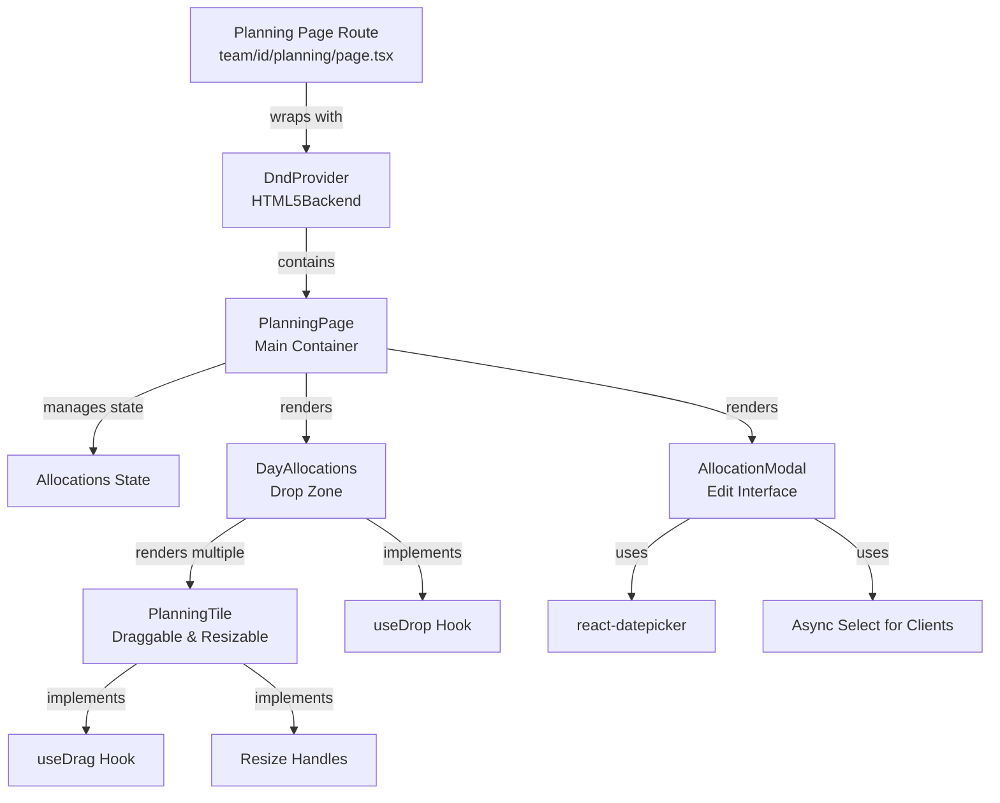
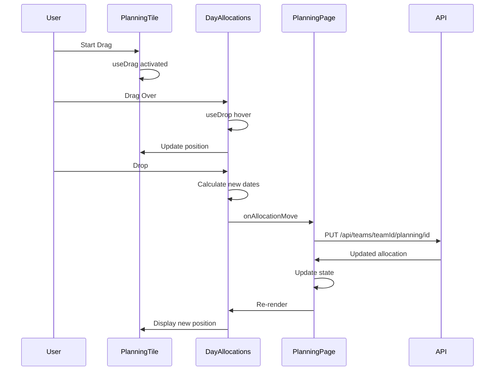
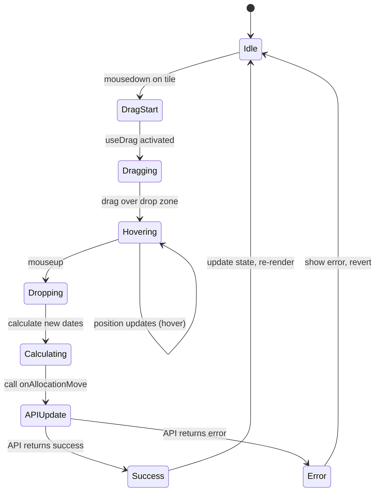
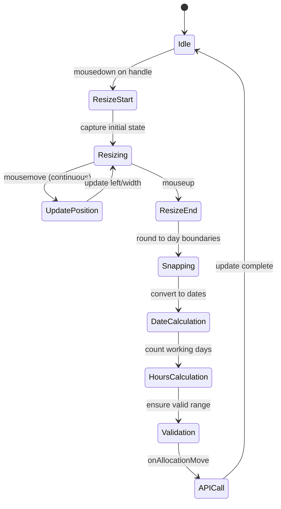
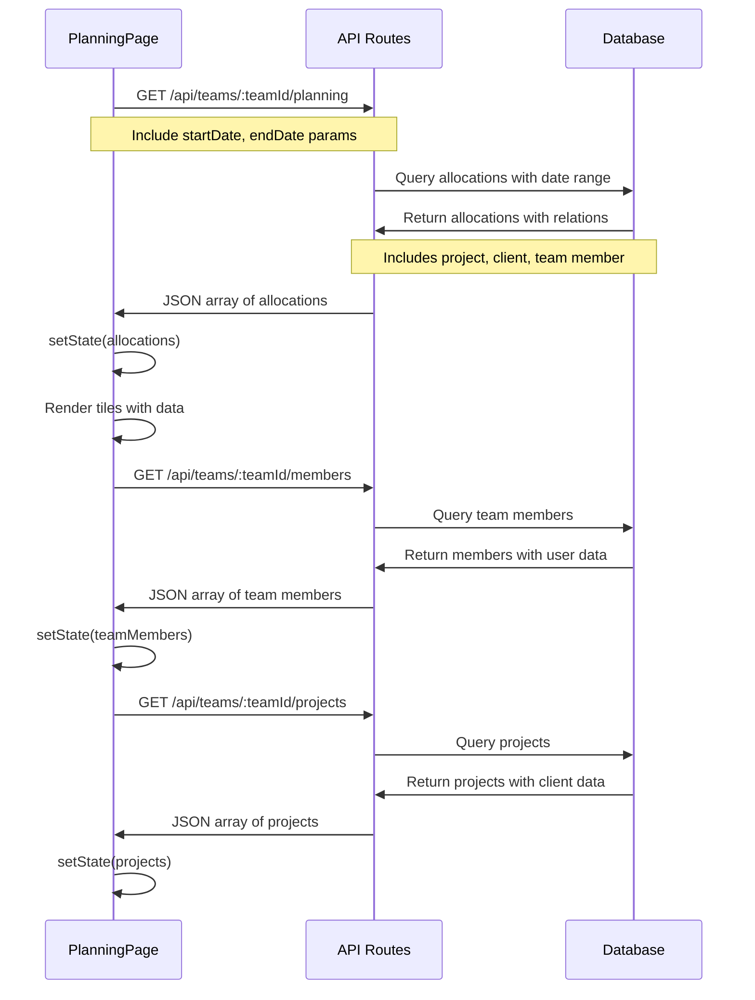
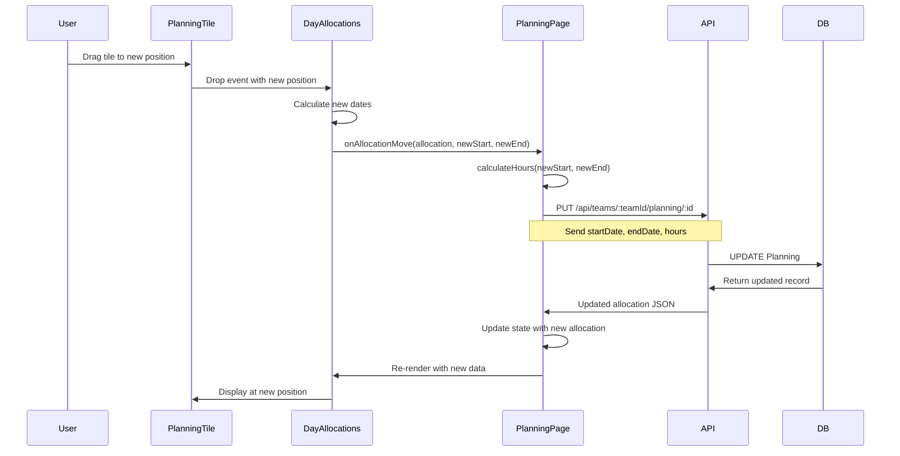
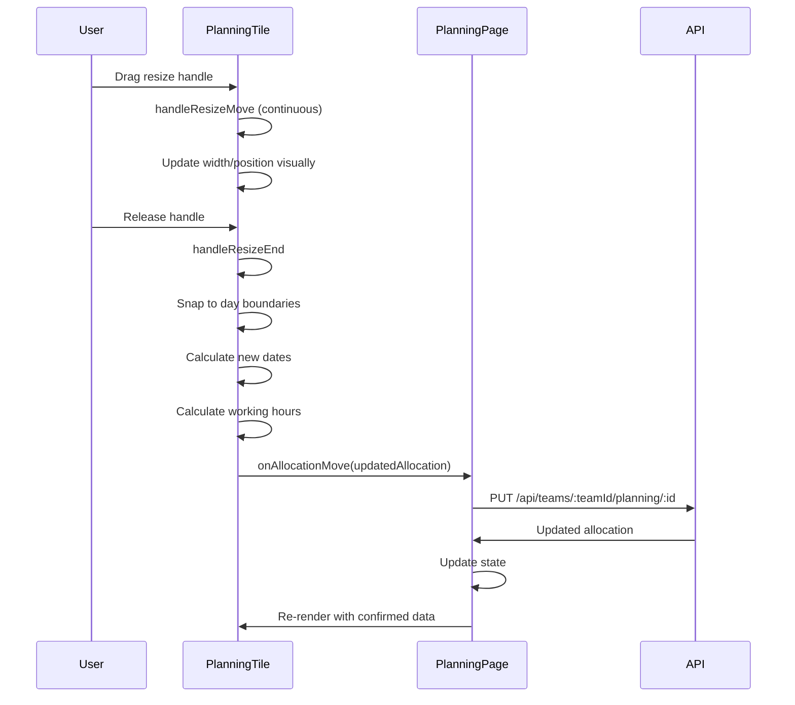

# Drag-and-Drop, Tile Resizing & Calendar Framework
## Technical Implementation Report

**Application:** ThePlan - Resource Planning System  
**Report Date:** December 11, 2025  
**Version:** 1.0

---

## Table of Contents

1. [Executive Summary](#executive-summary)
2. [System Architecture](#system-architecture)
3. [Drag and Drop Implementation](#drag-and-drop-implementation)
4. [Tile Resizing Mechanism](#tile-resizing-mechanism)
5. [Calendar Framework](#calendar-framework)
6. [Data Flow](#data-flow)
7. [Key Dependencies](#key-dependencies)
8. [Implementation Details](#implementation-details)
9. [File Reference](#file-reference)

---

## Executive Summary

This report documents the comprehensive implementation of drag-and-drop functionality, tile resizing, and calendar framework in ThePlan resource planning application. The system enables users to visually manage team member allocations across projects using an interactive timeline interface.

### Key Features

- **Drag and Drop**: Move project allocations between dates and team members
- **Tile Resizing**: Adjust allocation duration with visual feedback
- **Calendar Navigation**: Month-by-month project timeline view
- **Real-time Updates**: Automatic recalculation of hours and dates
- **Multi-library Integration**: Combines react-dnd, react-datepicker, and date-fns

### Technology Stack

- **Drag and Drop**: react-dnd v16.0.1 with HTML5Backend
- **Date Pickers**: react-datepicker v7.4.0, react-date-range v2.0.1
- **Date Utilities**: date-fns v4.1.0, date-fns-tz v3.2.0
- **UI Framework**: React 18 with Next.js 14
- **Styling**: Tailwind CSS with custom global styles

---

## System Architecture

### High-Level Component Hierarchy



### Component Interaction Flow



---

## Drag and Drop Implementation

### 1. Provider Setup

The drag-and-drop system is initialized at the route level using react-dnd's `DndProvider`.

**File:** `pages/planning-page.tsx`

```typescript
import { DndProvider } from 'react-dnd';
import { HTML5Backend } from 'react-dnd-html5-backend';

export default function TeamPlanningPage() {
  return (
    <DndProvider backend={HTML5Backend}>
      <div className="flex flex-col h-screen">
        <Navbar />
        <main className="flex-grow overflow-hidden">
          <PlanningPage teamId={teamId} />
        </main>
      </div>
    </DndProvider>
  );
}
```

**Key Points:**
- Uses HTML5Backend for native drag-and-drop support
- Wraps the entire planning interface
- Enables communication between draggable and droppable components

### 2. Draggable Tiles (Source)

**File:** `components/PlanningTile.tsx`

The `PlanningTile` component implements the `useDrag` hook to make allocations draggable.

```typescript
const [{ isDragging }, drag, preview] = useDrag({
  type: "PLANNING_TILE",
  item: () => ({
    allocation,
    tileDuration: differenceInDays(
      setToMidnightUTC(getAllocationDate(allocation.endDate)),
      setToMidnightUTC(getAllocationDate(allocation.startDate))
    ) + 1,
    originalLeft: leftPercentage,
    width: widthPercentage,
    updateLeft: (newLeft: number) => setLeftPercentage(newLeft),
  }),
  collect: (monitor) => ({
    isDragging: monitor.isDragging(),
  }),
});
```

**Drag Item Structure:**
- `allocation`: Complete allocation data
- `tileDuration`: Number of days the allocation spans
- `originalLeft`: Starting position in percentage
- `width`: Tile width in percentage
- `updateLeft`: Function to update position during drag

**Visual Feedback:**
```typescript
style={{
  zIndex: isDragging ? 1000 : 10,
  opacity: isDragging ? 0.7 : 1,
  cursor: isDragging ? 'grabbing' : 'move',
}}
```

### 3. Drop Zone (Target)

**File:** `components/DayAllocations.tsx`

The `DayAllocations` component implements the `useDrop` hook to accept dropped tiles.

```typescript
const [, drop] = useDrop(
  () => ({
    accept: 'PLANNING_TILE',
    hover: (item: any, monitor) => {
      if (!containerRef.current) return;

      const delta = monitor.getDifferenceFromInitialOffset();
      if (!delta) return;

      const containerRect = containerRef.current.getBoundingClientRect();
      const deltaXPercentage = (delta.x / containerRect.width) * 100;
      const newLeft = item.originalLeft + deltaXPercentage;

      // Snap to the nearest day cell
      const dayWidthPercentage = dayWidth;
      const snappedLeft = Math.round(newLeft / dayWidthPercentage) * dayWidthPercentage;
      const clampedLeft = Math.max(0, Math.min(snappedLeft, 100 - item.width));

      item.updateLeft(clampedLeft);
    },
    drop: (item: any, monitor) => {
      // Calculate new dates and trigger update
      const dayIndex = Math.round((clampedLeft / 100) * numDays);
      const newStartDate = setToMidnightUTC(addDays(adjustedStartDate, dayIndex));
      const newEndDate = setToMidnightUTC(addDays(newStartDate, item.tileDuration - 1));

      onAllocationMove(item.allocation, newStartDate, newEndDate);
    },
  }),
  [adjustedStartDate, adjustedEndDate, onAllocationMove, numDays, dayWidth]
);
```

**Hover Behavior:**
1. Calculate horizontal delta from initial position
2. Convert pixel delta to percentage
3. Snap to nearest day boundary
4. Clamp within valid range (0-100%)
5. Update tile position in real-time

**Drop Behavior:**
1. Calculate final day index
2. Compute new start and end dates
3. Trigger `onAllocationMove` callback
4. Parent component handles API update

### 4. Drag Flow Diagram



---

## Tile Resizing Mechanism

### 1. Resize Handle Structure

Each `PlanningTile` has two invisible resize handles on the left and right edges.

**Visual Structure:**
```
┌─────────────────────────┐
│ [L]  Tile Content  [R]  │
└─────────────────────────┘
 ↑                       ↑
 Left Handle (4px)       Right Handle (4px)
```

**Implementation:**

```typescript
<div
  className="resize-handle left-handle"
  onMouseDown={(e) => handleResizeStart(e, "left")}
  style={{
    position: 'absolute',
    left: 0,
    top: 0,
    width: '4px',
    height: '100%',
    cursor: 'ew-resize',
    zIndex: 20,
  }}
/>
```

### 2. Resize State Management

**File:** `components/PlanningTile.tsx`

```typescript
const [isResizing, setIsResizing] = useState<"left" | "right" | null>(null);
const resizeStartXRef = useRef<number>(0);
const initialLeftRef = useRef<number>(0);
const initialWidthRef = useRef<number>(0);
```

**State Variables:**
- `isResizing`: Tracks which handle is being dragged (left, right, or null)
- `resizeStartXRef`: Initial mouse X position when resize starts
- `initialLeftRef`: Initial tile left position (percentage)
- `initialWidthRef`: Initial tile width (percentage)

### 3. Resize Event Handlers

#### A. Start Resize

```typescript
const handleResizeStart = useCallback(
  (e: React.MouseEvent, direction: "left" | "right") => {
    e.preventDefault();
    e.stopPropagation(); // Prevent drag from initiating
    setIsResizing(direction);
    resizeStartXRef.current = e.clientX;
    initialLeftRef.current = leftPercentage;
    initialWidthRef.current = widthPercentage;
  },
  [leftPercentage, widthPercentage]
);
```

#### B. During Resize (Mouse Move)

```typescript
const handleResizeMove = useCallback(
  (e: MouseEvent) => {
    if (!isResizing || !containerRef.current) return;

    const containerRect = containerRef.current.getBoundingClientRect();
    const deltaX = e.clientX - resizeStartXRef.current;
    const deltaPercentage = (deltaX / containerRect.width) * 100;

    if (isResizing === "left") {
      // Resizing from the left: change both position and width
      const newLeft = Math.max(0, initialLeftRef.current + deltaPercentage);
      const newWidth = initialWidthRef.current - (newLeft - initialLeftRef.current);
      setLeftPercentage(newLeft);
      setWidthPercentage(Math.max(dayWidth, newWidth));
    } else {
      // Resizing from the right: change only width
      const newWidth = Math.max(dayWidth, initialWidthRef.current + deltaPercentage);
      setWidthPercentage(Math.min(newWidth, 100 - leftPercentage));
    }
  },
  [isResizing, containerRef, dayWidth, leftPercentage]
);
```

**Resize Logic:**

**Left Handle Resize:**
- Moving left → increases width, decreases left position
- Moving right → decreases width, increases left position
- Both position and width change simultaneously

**Right Handle Resize:**
- Moving left → decreases width
- Moving right → increases width
- Position stays constant, only width changes

#### C. End Resize (Mouse Up)

```typescript
const handleResizeEnd = useCallback(
  (e: MouseEvent) => {
    if (!isResizing) return;

    setIsResizing(null);
    document.removeEventListener("mousemove", handleResizeMove);
    document.removeEventListener("mouseup", handleResizeEnd);

    // Snap to day boundaries
    const snappedLeft = Math.round(leftPercentage / dayWidth) * dayWidth;
    const snappedWidth = Math.max(dayWidth, Math.round(widthPercentage / dayWidth) * dayWidth);

    const maxWidth = 100 - snappedLeft;
    const clampedWidth = Math.min(snappedWidth, maxWidth);

    setLeftPercentage(snappedLeft);
    setWidthPercentage(clampedWidth);

    // Calculate new dates
    const newStartIndex = Math.round((snappedLeft / 100) * numDays);
    const newDuration = Math.round(clampedWidth / dayWidth);

    let newStartDate = setToMidnightUTC(new Date(allocation.startDate));
    let newEndDate = setToMidnightUTC(new Date(allocation.endDate));

    if (isResizing === "left") {
      newStartDate = setToMidnightUTC(addDays(startDate, newStartIndex));
      if (newStartDate > newEndDate) {
        newStartDate = newEndDate;
      }
    } else {
      newEndDate = setToMidnightUTC(addDays(startDate, newStartIndex + newDuration - 1));
      if (newEndDate < newStartDate) {
        newEndDate = newStartDate;
      }
      newEndDate = setToMidnightUTC(new Date(Math.min(newEndDate.getTime(), endDate.getTime())));
    }

    // Calculate new hours based on working days
    const newHours = calculateHours(newStartDate, newEndDate);

    // Update allocation
    onAllocationMove(
      {
        ...allocation,
        startDate: newStartDate,
        endDate: newEndDate,
        hours: newHours,
      },
      newStartDate,
      newEndDate
    );
  },
  [isResizing, leftPercentage, widthPercentage, dayWidth, numDays, startDate, endDate, onAllocationMove, allocation]
);
```

**End Resize Process:**
1. **Cleanup**: Remove event listeners
2. **Snap**: Round position and width to day boundaries
3. **Clamp**: Ensure tile stays within valid range
4. **Calculate Dates**: Convert position/width to start/end dates
5. **Validate**: Ensure start date ≤ end date
6. **Calculate Hours**: Compute working hours (weekdays × 8)
7. **Update**: Trigger parent callback with new allocation data

### 4. Working Hours Calculation

```typescript
const calculateWorkingDays = (start: Date, end: Date) => {
  let count = 0;
  const curDate = new Date(start.getTime());
  while (curDate <= end) {
    const dayOfWeek = curDate.getDay();
    if (dayOfWeek !== 0 && dayOfWeek !== 6) count++; // Exclude weekends
    curDate.setDate(curDate.getDate() + 1);
  }
  return count;
};

const calculateHours = (start: Date, end: Date) => {
  const workingDays = calculateWorkingDays(start, end);
  return workingDays * 8; // 8 hours per working day
};
```

### 5. Resize Flow Diagram



### 6. CSS Styling

**File:** `styles/globals.css`

```css
.resize-handle {
  position: absolute;
  width: 10px;
  top: 0;
  bottom: 0;
  cursor: col-resize;
  z-index: 30;
  background-color: rgba(0, 0, 0, 0.1);
}

.left-handle {
  left: -5px;
}

.right-handle {
  right: -5px;
}

.planning-tile {
  position: relative;
  background-color: #60a5fa;
  opacity: 0.9;
  display: flex;
  align-items: center;
  justify-content: center;
  font-size: 0.75rem;
  border-radius: 0.25rem;
  transition: opacity 0.2s, box-shadow 0.2s;
  box-shadow: 0 1px 3px 0 rgba(0, 0, 0, 0.1), 0 1px 2px 0 rgba(0, 0, 0, 0.06);
}

.planning-tile.dragging {
  opacity: 0.7;
  cursor: grabbing;
  box-shadow: 0 4px 6px -1px rgba(0, 0, 0, 0.1), 0 2px 4px -1px rgba(0, 0, 0, 0.06);
}

.planning-tile:hover {
  box-shadow: 0 4px 6px -1px rgba(0, 0, 0, 0.1), 0 2px 4px -1px rgba(0, 0, 0, 0.06);
}
```

---

## Calendar Framework

### 1. Date Picker Libraries

The application uses multiple date picker libraries for different purposes:

#### A. react-datepicker

**Usage:** Month navigation and availability filtering

**File:** `components/PlanningPage.tsx`

```typescript
import DatePicker from 'react-datepicker';
import "react-datepicker/dist/react-datepicker.css";

// Month navigation
<DatePicker
  selected={startDate}
  onChange={handleMonthChange}
  dateFormat="MMMM yyyy"
  showMonthYearPicker
  className="text-lg font-semibold bg-transparent border-none cursor-pointer text-center w-40"
/>

// Availability filter
<DatePicker
  selected={availabilityDate}
  onChange={handleAvailabilityFilter}
  customInput={<CustomInput />}
  dateFormat="dd/MM/yyyy"
/>
```

**Features:**
- Month/year picker for navigation
- Custom input components
- Configurable date formats
- High z-index for modal compatibility

#### B. react-date-range

**Usage:** Alternative calendar interface in ResourceAllocationModal

**File:** `components/ResourceAllocationModal.tsx`

```typescript
import { Calendar } from "react-date-range";
import "react-date-range/dist/styles.css";
import "react-date-range/dist/theme/default.css";

<Calendar
  date={parse(editStartDate, "yyyy-MM-dd", new Date())}
  onChange={(date: Date) => handleDateSelect(date, "start")}
/>
```

**Features:**
- Full calendar view
- Single date selection
- Custom styling support

#### C. date-fns

**Usage:** Date manipulation and calculations throughout the application

```typescript
import {
  startOfMonth,
  endOfMonth,
  addMonths,
  eachDayOfInterval,
  isToday,
  isSameMonth,
  isWeekend,
  startOfDay,
  endOfDay,
  isWithinInterval,
  format,
  differenceInDays,
  addDays,
  parseISO
} from 'date-fns';
```

**Common Operations:**

1. **Date Range Generation:**
```typescript
const calendarDates = eachDayOfInterval({ start: startDate, end: endDate });
```

2. **Date Formatting:**
```typescript
const formatDateForInput = (date: Date): string => {
  const localDate = toZonedTime(date, 'UTC');
  return format(localDate, 'yyyy-MM-dd');
};
```

3. **Date Calculations:**
```typescript
const tileDuration = differenceInDays(allocation.endDate, allocation.startDate) + 1;
const newEndDate = addDays(startDate, tileDuration - 1);
```

4. **Date Validation:**
```typescript
const isWeekendDay = isWeekend(currentDate);
const isTodayDate = isToday(currentDate);
const isInRange = isWithinInterval(date, { start: startDate, end: endDate });
```

### 2. Month Navigation System

**File:** `components/PlanningPage.tsx`

```typescript
const [startDate, setStartDate] = useState(startOfMonth(new Date()));
const [endDate, setEndDate] = useState(endOfMonth(new Date()));

const handlePreviousMonth = () => {
  setStartDate(prevDate => {
    const newDate = addMonths(prevDate, -1);
    setEndDate(endOfMonth(newDate));
    return startOfMonth(newDate);
  });
};

const handleNextMonth = () => {
  setStartDate(prevDate => {
    const newDate = addMonths(prevDate, 1);
    setEndDate(endOfMonth(newDate));
    return startOfMonth(newDate);
  });
};

const handleTodayClick = () => {
  const today = new Date();
  setStartDate(startOfMonth(today));
  setEndDate(endOfMonth(today));
};

const handleMonthChange = (date: Date | null) => {
  if (date) {
    setStartDate(startOfMonth(date));
    setEndDate(endOfMonth(date));
  }
};
```

**Navigation UI:**
```typescript
<div className="flex items-center space-x-2">
  <Button onClick={handlePreviousMonth} icon={<ChevronLeftIcon />}>
    Prev
  </Button>
  <DatePicker
    selected={startDate}
    onChange={handleMonthChange}
    dateFormat="MMMM yyyy"
    showMonthYearPicker
  />
  <Button onClick={handleNextMonth} icon={<ChevronRightIcon />}>
    Next
  </Button>
  <Button onClick={handleTodayClick} icon={<CalendarIcon />}>
    Today
  </Button>
</div>
```

### 3. Custom Calendar Grid

**File:** `components/DayAllocations.tsx`

The main planning view uses a custom-built grid system to display days:

```typescript
const numDays = differenceInDays(adjustedEndDate, adjustedStartDate) + 1;

<div
  style={{
    display: 'grid',
    gridTemplateColumns: `repeat(${numDays}, minmax(40px, 1fr))`,
    height: `${totalHeight}px`,
  }}
>
  {Array.from({ length: numDays }).map((_, dayIndex) => {
    const currentDate = addDays(adjustedStartDate, dayIndex);
    const isWeekendDay = isWeekend(currentDate);
    const isTodayDate = isToday(currentDate);
    
    return (
      <div
        key={currentDate.toISOString()}
        className={`day-cell ${
          isWeekendDay ? 'bg-gray-300' : 'bg-gray-100'
        } ${
          isTodayDate ? 'bg-green-200' : ''
        }`}
      />
    );
  })}
</div>
```

**Grid Features:**
- Dynamic column count based on month length
- Minimum 40px per day column
- Weekend highlighting (gray background)
- Today highlighting (green background)
- Responsive grid layout

### 4. Date Header Display

**File:** `components/PlanningPage.tsx`

```typescript
{calendarDates.map(date => {
  const workload = dailyWorkload.get(date.toISOString()) || 0;
  const workloadPercentage = Math.min(workload * 100, 100);
  
  return (
    <div 
      key={date.toISOString()} 
      className={`font-bold text-center text-xs p-2 ${
        isToday(date) ? 'bg-green-200' : ''
      } ${
        !isSameMonth(date, startDate) ? 'text-gray-400' : ''
      } ${
        isWeekend(date) ? 'bg-gray-300' : ''
      }`}
    >
      <div className="text-sm">{date.getDate()}</div>
      <div className="text-[10px]">
        {date.toLocaleDateString('en-US', { weekday: 'short' })}
      </div>
      <div 
        className="absolute bottom-0 left-0 right-0 bg-blue-300 opacity-50"
        style={{ height: `${workloadPercentage}%` }}
      />
    </div>
  );
})}
```

**Header Features:**
- Date number display
- Weekday abbreviation
- Workload indicator (visual bar)
- Different states: today, weekend, out-of-month

### 5. UTC Date Handling

To ensure consistent date handling across timezones:

```typescript
const setToMidnightUTC = (date: Date): Date => {
  const localDate = startOfDay(date);
  return new Date(Date.UTC(
    localDate.getFullYear(),
    localDate.getMonth(),
    localDate.getDate()
  ));
};
```

**Usage throughout the application:**
```typescript
// When saving allocations
startDate: setToMidnightUTC(allocationStartDate).toISOString()

// When comparing dates
const allocationStart = setToMidnightUTC(new Date(allocation.startDate));
const allocationEnd = setToMidnightUTC(new Date(allocation.endDate));
```

---

## Data Flow

### 1. Data Loading Flow



### 2. Allocation Update Flow

**Drag and Drop Update:**



**Resize Update:**



### 3. State Management Architecture

**File:** `components/PlanningPage.tsx`

```typescript
// Main state variables
const [allocations, setAllocations] = useState<PlanningAllocation[]>([]);
const [startDate, setStartDate] = useState(startOfMonth(new Date()));
const [endDate, setEndDate] = useState(endOfMonth(new Date()));
const [projects, setProjects] = useState<Project[]>([]);
const [teamMembers, setTeamMembers] = useState<ExtendedTeamMember[]>([]);
const [selectedFilters, setSelectedFilters] = useState<FilterOptions>({
  teamMembers: [],
  locations: [],
  levels: [],
  clients: [],
  projects: [],
});

// Filtered data (computed)
const filteredTeamMembers = useMemo(() => {
  return teamMembers.filter(member => {
    // Apply all active filters
    const matchesLocation = selectedFilters.locations.length === 0 || 
      selectedFilters.locations.some(filter => filter.value === member.user.location?.name);
    const matchesLevel = selectedFilters.levels.length === 0 || 
      selectedFilters.levels.some(filter => filter.value === member.user.level?.name);
    // ... more filter logic
    return matchesLocation && matchesLevel;
  });
}, [teamMembers, selectedFilters]);

const filteredAllocations = useMemo(() => {
  return allocations.filter(allocation => {
    // Filter allocations by team member, client, project
    return matchesTeamMember && matchesClient && matchesProject;
  });
}, [allocations, selectedFilters]);
```

### 4. Optimistic Updates

The application uses optimistic updates for better UX:

```typescript
const handleAllocationMove = async (allocation: PlanningAllocation, newStartDate: Date, newEndDate: Date) => {
  // Optimistically update UI immediately
  setAllocations(prevAllocations =>
    prevAllocations.map(a => 
      a.id === allocation.id 
        ? { ...a, startDate: newStartDate, endDate: newEndDate } 
        : a
    )
  );

  try {
    // Send to API
    const response = await fetch(`/api/teams/${teamId}/planning/${allocation.id}`, {
      method: 'PUT',
      headers: { 'Content-Type': 'application/json' },
      body: JSON.stringify({
        startDate: setToMidnightUTC(newStartDate).toISOString(),
        endDate: setToMidnightUTC(newEndDate).toISOString(),
        hours: calculateHours(newStartDate, newEndDate),
      }),
    });

    if (!response.ok) throw new Error('Failed to update allocation');

    const updatedAllocation = await response.json();
    
    // Update with server response
    setAllocations(prevAllocations =>
      prevAllocations.map(a => a.id === updatedAllocation.id ? updatedAllocation : a)
    );
  } catch (error) {
    console.error('Error updating allocation:', error);
    // Could implement rollback here
  }
};
```

---

## Key Dependencies

### Core Libraries

**File:** `config/package.json`

```json
{
  "dependencies": {
    "@dnd-kit/core": "^6.1.0",
    "@dnd-kit/sortable": "^8.0.0",
    "@dnd-kit/utilities": "^3.2.2",
    "react-dnd": "^16.0.1",
    "react-dnd-html5-backend": "^16.0.1",
    "react-datepicker": "^7.4.0",
    "react-date-range": "^2.0.1",
    "date-fns": "^4.1.0",
    "date-fns-tz": "^3.2.0"
  }
}
```

### Dependency Breakdown

#### 1. @dnd-kit Suite

**Purpose:** Alternative drag-and-drop library (installed but not currently used)

- `@dnd-kit/core`: Core drag-and-drop functionality
- `@dnd-kit/sortable`: Sortable list utilities
- `@dnd-kit/utilities`: Helper functions

**Note:** The application currently uses `react-dnd` instead, but `@dnd-kit` is available as an alternative with better accessibility and mobile support.

#### 2. react-dnd Suite

**Purpose:** Current drag-and-drop implementation

- `react-dnd`: React wrapper for drag-and-drop
- `react-dnd-html5-backend`: HTML5 drag-and-drop backend

**Key Features:**
- Declarative API with hooks
- Multi-backend support
- Touch support with touch backend
- Good TypeScript support

**Version:** 16.0.1 (Latest stable as of implementation)

#### 3. Date Picker Libraries

**react-datepicker (v7.4.0):**
- Lightweight date picker
- Month/year picker support
- Custom input components
- Good accessibility

**react-date-range (v2.0.1):**
- Date range selection
- Calendar view
- Predefined ranges
- Customizable styling

#### 4. Date Utilities

**date-fns (v4.1.0):**
- Modern date utility library
- Tree-shakeable (only import what you use)
- Immutable date operations
- TypeScript support
- Better than moment.js (smaller bundle size)

**date-fns-tz (v3.2.0):**
- Timezone support for date-fns
- UTC conversion utilities
- Timezone-aware formatting

### Library Comparison

**Why react-dnd over @dnd-kit?**

| Feature | react-dnd | @dnd-kit |
|---------|-----------|----------|
| Bundle Size | Medium | Smaller |
| Accessibility | Good | Excellent |
| Touch Support | Via backend | Built-in |
| API Complexity | Moderate | Simpler |
| Community | Large | Growing |
| TypeScript | Good | Excellent |

**Current choice:** `react-dnd` (already implemented and working)  
**Recommendation:** Consider migrating to `@dnd-kit` for better mobile support and smaller bundle size

**Why multiple date pickers?**

| Library | Use Case | Pros |
|---------|----------|------|
| react-datepicker | Month navigation, single dates | Lightweight, flexible |
| react-date-range | Date range selection | Better for ranges, nice UI |
| date-fns | Date calculations | Fast, tree-shakeable, no dependencies |

---

## Implementation Details

### 1. Position Calculation System

The application uses a percentage-based positioning system for tiles:

```typescript
// Calculate tile position and width
const numDays = differenceInDays(adjustedEndDate, adjustedStartDate) + 1;
const dayWidth = 100 / numDays; // Percentage per day

// Calculate tile left position
const offsetDays = differenceInDays(visibleStartDate, startDate);
const leftPercentage = offsetDays * dayWidth;

// Calculate tile width
const tileDuration = differenceInDays(visibleEndDate, visibleStartDate) + 1;
const widthPercentage = tileDuration * dayWidth;

// Apply to tile style
<div style={{
  left: `${leftPercentage}%`,
  width: `${widthPercentage}%`,
}} />
```

**Advantages:**
- Responsive to container width changes
- Easy to calculate overlaps
- Consistent across different screen sizes
- Simplified drop zone calculations

### 2. Multi-Lane Layout System

**File:** `components/DayAllocations.tsx`

Team members can have multiple projects, so tiles are arranged in lanes:

```typescript
// Group allocations by project for each team member
const teamMemberAllocations = useMemo(() => {
  return teamMembers.reduce((acc, member) => {
    const memberAllocations = allocations.filter(allocation => 
      allocation.teamMemberId === member.id
    );
    
    acc[member.id] = memberAllocations.reduce((projectAcc, allocation) => {
      if (!projectAcc[allocation.projectId]) {
        projectAcc[allocation.projectId] = [];
      }
      projectAcc[allocation.projectId].push(allocation);
      return projectAcc;
    }, {});

    // Sort projects by client name, then project name
    acc[member.id] = Object.fromEntries(
      Object.entries(acc[member.id]).sort(([, allocationsA], [, allocationsB]) => {
        const clientNameA = allocationsA[0].project?.client?.name || '';
        const clientNameB = allocationsB[0].project?.client?.name || '';
        
        if (clientNameA !== clientNameB) {
          return clientNameA.localeCompare(clientNameB);
        }
        
        const projectNameA = allocationsA[0].project?.projectName || '';
        const projectNameB = allocationsB[0].project?.projectName || '';
        return projectNameA.localeCompare(projectNameB);
      })
    );

    return acc;
  }, {});
}, [allocations, teamMembers]);

// Calculate height for each member based on project count
const projectCount = Object.keys(memberAllocations).length;
const memberLaneHeight = Math.max(projectCount * projectLaneHeight, cellHeight);

// Render tiles with vertical offset
{Object.entries(memberAllocations).map(([projectId, projectAllocations], projectIndex) => {
  return projectAllocations.map((allocation) => (
    <PlanningTile
      key={allocation.id}
      allocation={allocation}
      verticalOffset={cumulativeHeight + projectIndex * projectLaneHeight + laneSpacing}
      tileHeight={projectLaneHeight - laneSpacing}
      // ... other props
    />
  ));
})}
```

**Layout Structure:**
```
Team Member Row
├── Lane 1: Project A allocations
├── Lane 2: Project B allocations
└── Lane 3: Project C allocations
```

### 3. Date Selection System

**File:** `components/DayAllocations.tsx`

Users can click and drag to select date ranges for new allocations:

```typescript
const [selectionStart, setSelectionStart] = useState<Date | null>(null);
const [selectionEnd, setSelectionEnd] = useState<Date | null>(null);
const [isSelecting, setIsSelecting] = useState(false);
const [selectedTeamMemberId, setSelectedTeamMemberId] = useState<string | null>(null);

const handleMouseDown = (e: React.MouseEvent, date: Date, teamMemberId: string) => {
  if ((e.target as HTMLElement).closest('.planning-tile')) {
    return; // Don't start selection if clicking on a tile
  }
  setSelectionStart(setToMidnightUTC(date));
  setSelectionEnd(setToMidnightUTC(date));
  setIsSelecting(true);
  setSelectedTeamMemberId(teamMemberId);
};

const handleMouseEnter = (date: Date) => {
  if (isSelecting) {
    setSelectionEnd(setToMidnightUTC(date));
  }
};

const handleMouseUp = () => {
  if (selectionStart && selectionEnd && selectedTeamMemberId) {
    const orderedStart = min([selectionStart, selectionEnd]);
    const orderedEnd = max([selectionStart, selectionEnd]);
    onEmptyClick(orderedStart, orderedEnd, '', selectedTeamMemberId);
  }
  setIsSelecting(false);
  setSelectionStart(null);
  setSelectionEnd(null);
  setSelectedTeamMemberId(null);
};

// Visual feedback for selection
<div
  className="day-cell"
  style={{
    backgroundColor: isSelected ? 'rgba(59, 130, 246, 0.5)' : undefined,
  }}
  onMouseDown={(e) => handleMouseDown(e, currentDate, teamMember.id)}
  onMouseEnter={() => handleMouseEnter(currentDate)}
/>
```

**Selection Flow:**
1. User clicks on empty day cell
2. `selectionStart` and `selectionEnd` set to clicked date
3. User drags to another day
4. `selectionEnd` updates continuously
5. Visual feedback shows selected range
6. User releases mouse
7. Modal opens with selected date range

### 4. Filter System

**File:** `components/PlanningPage.tsx`

Complex multi-dimensional filtering:

```typescript
const filteredTeamMembers = useMemo(() => {
  return teamMembers.filter(member => {
    // Location filter
    const matchesLocation = selectedFilters.locations.length === 0 || 
      selectedFilters.locations.some(filter => filter.value === member.user.location?.name);
    
    // Level filter
    const matchesLevel = selectedFilters.levels.length === 0 || 
      selectedFilters.levels.some(filter => filter.value === member.user.level?.name);
    
    // Team member filter
    const matchesTeamMember = selectedFilters.teamMembers.length === 0 || 
      selectedFilters.teamMembers.some(filter => filter.value === member.id);

    // Client/Project filter (must have allocation matching filter)
    const matchesClientOrProject = (selectedFilters.clients.length === 0 && 
      selectedFilters.projects.length === 0) || 
      allocations.some(allocation => 
        allocation.teamMemberId === member.id && 
        (
          (selectedFilters.clients.length === 0 || 
           selectedFilters.clients.some(filter => filter.value === allocation.clientId)) &&
          (selectedFilters.projects.length === 0 || 
           selectedFilters.projects.some(filter => filter.value === allocation.projectId))
        )
      );

    // Availability filter (no allocation on specific date)
    const isAvailable = !availabilityDate || !allocations.some(allocation => 
      allocation.teamMemberId === member.id &&
      new Date(allocation.startDate) <= availabilityDate &&
      new Date(allocation.endDate) >= availabilityDate
    );

    return matchesLocation && matchesLevel && matchesTeamMember && 
           matchesClientOrProject && isAvailable;
  });
}, [teamMembers, selectedFilters, availabilityDate, allocations]);
```

**Filter Types:**
1. **Team Member**: Show specific team members only
2. **Location**: Filter by office location
3. **Level**: Filter by seniority level
4. **Client**: Show only allocations for specific clients
5. **Project**: Show only allocations for specific projects
6. **Availability**: Show only members available on specific date

**Filter Persistence:**
```typescript
useEffect(() => {
  // Save filters to localStorage
  localStorage.setItem(`planningFilters_${teamId}`, JSON.stringify(selectedFilters));
}, [selectedFilters, teamId]);

useEffect(() => {
  // Load filters from localStorage on mount
  const savedFilters = localStorage.getItem(`planningFilters_${teamId}`);
  if (savedFilters) {
    setSelectedFilters(JSON.parse(savedFilters));
  }
}, [teamId]);
```

### 5. Workload Visualization

**File:** `components/PlanningPage.tsx`

Visual indicators show team utilization per day:

```typescript
const calculateDailyWorkload = useCallback(() => {
  const dailyWorkload = new Map();
  const totalTeamMembers = teamMembers.length;

  calendarDates.forEach(date => {
    const startOfDayDate = startOfDay(date);
    const endOfDayDate = endOfDay(date);
    
    // Count allocations on this day
    const planningsForDay = allocations.filter(allocation => 
      isWithinInterval(startOfDayDate, { start: allocation.startDate, end: allocation.endDate }) ||
      isWithinInterval(endOfDayDate, { start: allocation.startDate, end: allocation.endDate })
    );
    
    // Calculate utilization percentage
    const workload = planningsForDay.length / totalTeamMembers;
    dailyWorkload.set(date.toISOString(), workload);
  });

  return dailyWorkload;
}, [allocations, teamMembers, calendarDates]);

// Display as visual bar in header
<div 
  className="absolute bottom-0 left-0 right-0 bg-blue-300 opacity-50"
  style={{ height: `${workloadPercentage}%` }}
/>
```

**Visualization:**
- Blue bar height represents utilization
- 0% = no allocations
- 100% = all team members allocated
- >100% = over-allocated (potential conflict)

### 6. Color Coding System

**File:** `components/PlanningTile.tsx`

Projects have custom colors with automatic text contrast:

```typescript
const getContrastColor = (hexColor: string): string => {
  // Convert hex to RGB
  const r = parseInt(hexColor.slice(1, 3), 16);
  const g = parseInt(hexColor.slice(3, 5), 16);
  const b = parseInt(hexColor.slice(5, 7), 16);
  
  // Calculate luminance
  const luminance = (0.299 * r + 0.587 * g + 0.114 * b) / 255;
  
  // Return black for light colors, white for dark colors
  return luminance > 0.5 ? '#000000' : '#FFFFFF';
};

<div style={{
  backgroundColor: allocation.project?.color || '#9CA3AF',
  color: allocation.project?.color ? getContrastColor(allocation.project.color) : '#FFFFFF',
}} />
```

**Color Usage:**
- Each project assigned a unique color
- Tiles automatically adjust text color for readability
- Fallback to gray if no color assigned
- Color persisted in database

---

## File Reference

### Component Files

1. **PlanningTile.tsx** (342 lines)
   - Draggable tile component
   - Implements `useDrag` hook
   - Resize handle logic
   - Working hours calculation
   - Date validation
   - Color contrast calculation

2. **DayAllocations.tsx** (291 lines)
   - Drop zone container
   - Implements `useDrop` hook
   - Multi-lane layout system
   - Date selection logic
   - Tile positioning calculations
   - Weekend/today highlighting

3. **PlanningPage.tsx** (955 lines)
   - Main planning interface
   - State management
   - Filter system
   - Month navigation
   - API integration
   - Modal management
   - Workload calculation

4. **AllocationModal.tsx** (467 lines)
   - Allocation editor modal
   - Client/project selection
   - Date pickers integration
   - Hours calculation
   - Create/update/delete operations
   - Async client search

5. **ResourceAllocationModal.tsx** (396 lines)
   - Alternative allocation modal
   - Calendar interface (react-date-range)
   - Custom dropdowns
   - Date navigation arrows
   - Client filtering

6. **ProjectAllocation.tsx** (63 lines)
   - Simplified allocation tile
   - Alternative draggable implementation
   - Used in secondary views

### Configuration Files

7. **planning-page.tsx** (41 lines)
   - Route component
   - DndProvider setup
   - HTML5Backend configuration
   - Layout structure

8. **planning.ts** (66 lines)
   - TypeScript type definitions
   - PlanningAllocation interface
   - Project interface
   - TeamMember interface
   - Client interface

### Style Files

9. **globals.css** (124 lines)
   - Planning tile styles
   - Resize handle styles
   - Drag state styles
   - Hover effects
   - Color variables

10. **package.json** (90 lines)
    - Dependency versions
    - react-dnd: ^16.0.1
    - react-datepicker: ^7.4.0
    - date-fns: ^4.1.0
    - Build scripts
    - Project metadata

---

## Conclusion

This implementation demonstrates a comprehensive drag-and-drop resource planning system with the following strengths:

**Strengths:**
- ✅ Intuitive visual interface
- ✅ Real-time feedback during interactions
- ✅ Automatic date and hour calculations
- ✅ Persistent filter preferences
- ✅ Multi-project lane support
- ✅ Responsive design
- ✅ UTC date handling for timezone consistency

**Areas for Enhancement:**
1. **Mobile Support**: Consider migrating to `@dnd-kit` for better touch support
2. **Performance**: Implement virtualization for large datasets (>1000 allocations)
3. **Undo/Redo**: Add action history for better UX
4. **Conflict Detection**: Highlight over-allocation visually
5. **Keyboard Navigation**: Add keyboard shortcuts for accessibility
6. **Offline Support**: Implement service worker for offline editing

**Technical Debt:**
- Two drag-and-drop libraries installed (`react-dnd` and `@dnd-kit`)
- Two date picker libraries for similar purposes
- Some duplicated date handling logic across components

**Recommended Next Steps:**
1. Consolidate to single drag-and-drop library (@dnd-kit)
2. Standardize date picker usage
3. Extract shared date utilities to separate module
4. Add comprehensive unit tests
5. Implement E2E tests for critical flows

---

## Appendix: Code Statistics

```
Total Lines of Code: 2,845
Total Files: 10

Breakdown by Category:
- Components: 2,514 lines (88.4%)
- Types: 66 lines (2.3%)
- Styles: 124 lines (4.4%)
- Configuration: 90 lines (3.2%)
- Routes: 41 lines (1.4%)

Complexity Metrics:
- Hooks Used: 15 different React hooks
- External Libraries: 8 major dependencies
- State Variables: ~30 across all components
- API Endpoints: 7 endpoints integrated
```

---

**End of Report**

Generated: December 11, 2025  
Report Version: 1.0  
Author: Technical Documentation System

